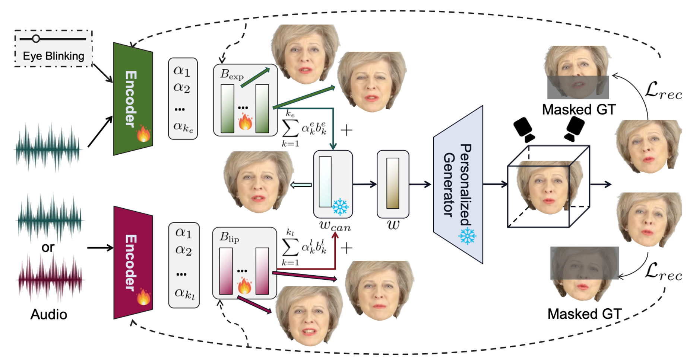

<!-- Using HTML to center the abstract -->
<div class="columns is-centered has-text-centered">
    <div class="column is-four-fifths">
        <h2>Abstract</h2>
        <div class="content has-text-justified">
In this work, we investigate the generation of high-fidelity, audio-driven 3D Gaussian talking heads from monocular videos. We present DGTalker, an innovative framework designed for real-time, high-fidelity, and 3D-aware talking head synthesis. By leveraging Gaussian generative priors and treating the task as a latent space navigation problem, our method effectively alleviates the lack of 3D information and the low-quality detail reconstruction caused by the absence of structure priors in monocular videos, a longstanding challenge in existing 3DGS-based approaches.  To ensure precise lip synchronization and nuanced expression control, we propose a disentangled latent space navigation method that independently models lip motion and talking expressions. Additionally, we introduce an effective masked cross-view supervision strategy to enable robust learning within the disentangled framework. We conduct extensive experiments and demonstrate that DGTalker surpasses current state-of-the-art methods in visual quality, motion accuracy, and controllability.
        </div>
    </div>
</div>

---


## Overview

Overall Framework of DGTalker. We design a disentangled navigation framework consisting of an anchor $w_{can}$, which encodes a global canonical expression for a specific identity, and two sets of learnable, orthogonal blendshapes ${B_\text{exp}, B_\text{lip}}$ containing $k_e$ and $k_l$ vectors, respectively. Each vector corresponds to a disentangled variation in upper/lower face expressions. The input audio is used to regress the coefficients of these blendshapes. To ensure effective learning, we randomly feed the encoder with different audio inputs and render the output images from two viewpoints. The corresponding masked ground-truth (GT) images are then used for supervision.



## Visualization && Controllability
The learned components possess well-defined semantic meaning, and we show the changes of the two blendshapes as the coefficients vary.


DGTalker enables generating diverse talking expressions from the same speech content, providing superior controllability.

<div align="center">
  <video width="480" controls>
    <source src="static/video/control.mp4" type="video/mp4">
  </video>
</div>


## Comparison to SOTA
We design three settings to evaluate the 3D-aware reconstruction quality and lip-audio synchronization ability.

For the self-driven setting,
<div align="center" style="display: flex; justify-content: center; gap: 40px;">
  <div>
    <p><b>May</b></p>
    <video width="480" controls>
      <source src="static/video/May_front.mp4" type="video/mp4">
    </video>
  </div>

  <div>
    <p><b>Shaheen</b></p>
    <video width="480" controls>
      <source src="static/video/Shaheen_front.mp4" type="video/mp4">
    </video>
  </div>
</div>

For the 3D-aware self-driven setting,
<div align="center" style="display: flex; justify-content: center; gap: 40px;">
  <div>
    <video width="480" controls>
      <source src="static/video/May_spiral.mp4" type="video/mp4">
    </video>
  </div>

  <div>
    <video width="480" controls>
      <source src="static/video/Shaheen_spiral.mp4" type="video/mp4">
    </video>
  </div>
</div>

For the 3D-aware audio generalization setting,

<div align="center">
  <video width="480" controls>
    <source src="static/video/May_unseen.mp4" type="video/mp4">
    .
  </video>
</div>
## Citation(Coming Soon)

```
BibTex Code Here
```
